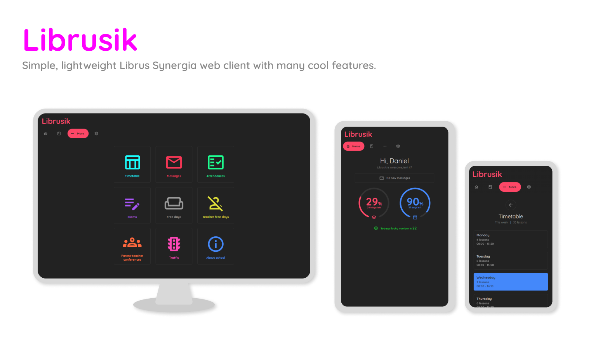

## Features

### Librus Synergia:

📋 Grades (with independent average calculation - works even if school has disabled it)

🗓️ Timetable

✉️ Messages (with downloading attachments) (outgoing messages are unsupported)

✅ Presences & Absences (with per-semester per-subject frequency %% calculation)

✏️ Exams

🏠 School free days

🧑‍🏫 Teacher free days

👪 Parent-teacher conferences

🏫 About school


### Client (Librusik UI):

🌙 Dark theme

🍪 Cookies (you won't be logged out each time you close the browser)

🧹 Grades cleanup (removes subjects without grades from Grades page)

🔮 Average predictor (edit final grades in average screen to predict your final average)

⌛ Cool countdown meters on home screen

🎉 Party mode

✨ ...and many more!

-----

## Installation

This app __will not run on Windows__. And no support for it, ever.

__1. Install required dependencies:__

```
pip install -r requirements.txt
```


__2. Clone the repo:__
```
git clone https://gitlab.com/dani3l0/librusik Librusik
cd Librusik
```

__3. And, finally run it:__
```
python3 librusik.py
```

__4. Done! Librusik is now running at [localhost:7777](http://localhost:7777).__

-----

## Configuration

Librusik will generate `data` dir upon its first boot. You can edit `data/config.json` file and adjust the preferences to your liking. Some of them can be set from Panel.

You can use [localhost:7777/panel](http://localhost:7777/panel) to manage your Librusik instance. Default user is `admin` and password is `admin`.

-----

## Some other words

Because this was my first app written in Python, code quality is quite meh. Don't expect code to be super readable and flexible.

_It just works_
